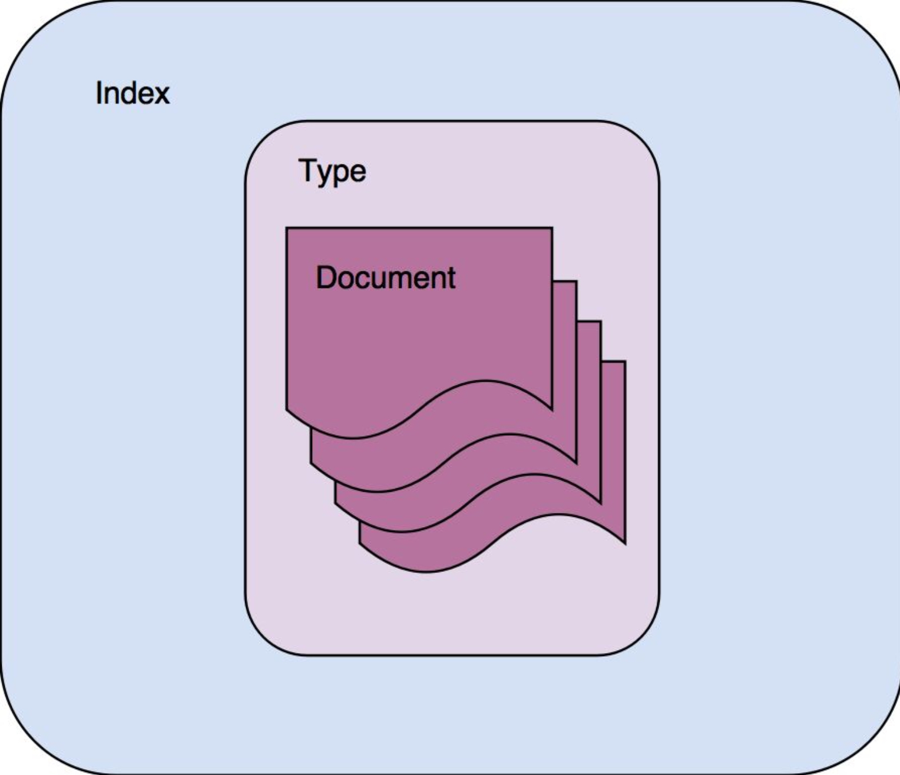
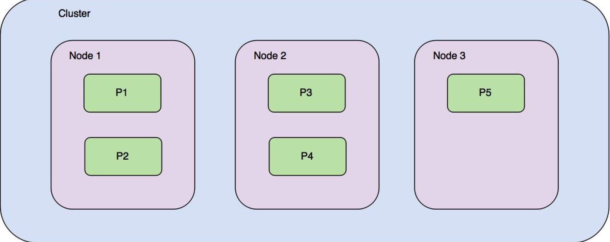
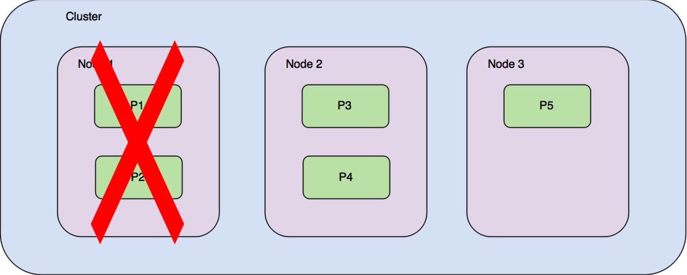
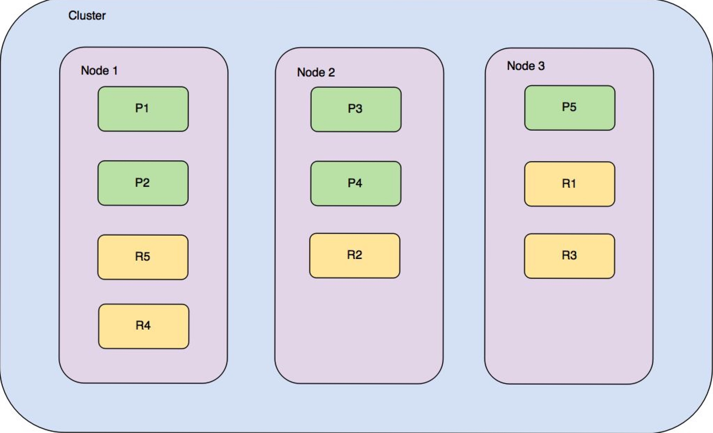

# 核心概念

## Index

**Index**是ES中存储和管理单个**Type**的文档容器

ES中的**Index**的概念类似关系数据库中的数据库schema，ES中的**Type**等效于表(table),ES中的**Document**等效于表中的记录。但该类比只是为了便于理解，与关系型数据库架构不同，**一个Index只能包含一个Type**。(6.0开始官方不允许在一个index下建立多个type，统一type名称：doc)

## Type

**Type**用于在**Index**中对相同类型的文档进行逻辑分组或组织

## Document

**Document**包含多个字段。JSON文档中的每个字段都有特定类型

ES包含一些内部元字段：

* _id: 文档的唯一标识，类似于数据库表中的主键，它可以由用户指定或自动生成
* _type: 该字段包含文档的类型
* _index: 该字段包含文档的索引名

## Node

* ES的Node是一个ES的单服务器实例，它可以是较大集群节点的一部分。它参与构建索引，搜索和执行ES支持的其他操作。每个ES的Node在启动时都会分配一个唯一的ID和名称。还可以通过ES配置文件`(config/elasticsearch.yml)`中的`node.name`参数为节点分配静态名称。
* 在最低的级别，一个节点对应于一个es进程的实例。负责管理其数据共享

## Cluster

* 一个集群承载一个或多个索引，并负责提供搜索、索引和聚合等操作。集群有一个或多个node组成。
* 建议修改ES配置文件`(config/elasticsearch.yml)`中的`cluster.name`属性，以避免加入同一个网络中的另一个集群

## Shards and replicas

### Shards

* 分片是为了解决存储大规模数据的问题，将数据切分分别存储到不同的分片中
* 将数据在分片之间划分的过程称为`sharding`
  * 它有助于利用集群不同节点进行存储
  * 它有助于利用集群不同节点的处理能力
* 默认情况下，每个索引都配置5个分片。在创建索引时，可以指定数据用于索引的分片数，创建索引后，无法修改分片数

下图说明了如何在三节点集群上分配一个索引的5个分片

在图中，分片名为P1到P5。每个分片包含大约五分之一的索引中存储的总数据。当针对此索引进行查询时，ES会处理所有分片并合并结果

### Replicas

当其中一个节点(节点1)关闭，当使用到节点1时，我们会丢失存储在分片P1和P2中的数据共享，
尽管硬件出现故障，但ES依旧可以运行，它通过`副本分片`(replicas shards)或`副本`(replicas)解决,副本分片是原分片的副本，可提供高可用数据

总之，节点(Node)聚集在一起形成一个集群。集群(Cluster)提供一个物理服务层，可以在该层创建多个索引(Index)。索引可以包含一个或多个类型(Type)，每个type包含数百万或数十亿个文档(Document)。索引被拆分为分片(Shard)，即索引中基础数据的分区。分片分布在集群的节点上。副本(Replicas)是主分片的副本，提供高可用性和故障转移。

## Mappings and types

### **Data types**

`ES`支持多种数据类型，以支持不同的存储场景，包含文本数据、数字、布尔值、二进制对象、数组、对象、嵌套类型、geo-points、geo-shapes和许多其他专用数据类型(如IPv4、IPv6地址)

* `String` datatypes：
  * `text`：text字段类型可用于支持包含描述或冗长文本值的字段进行全文搜索
  * `keyword`：keyword类型支持对字符串进行分析。该类型的字段支持排序，筛选和聚合
* `Numeric` datatypes：
  * `byte，short，integer和long`：分别为带符号的8-bit，16-bit，32-bit和64-bit精度的整数
  * `float和double`：具有单精度32位和双精度64位的IEEE 754 浮点数
  * `half_float`：具有半精度16位表示的浮点数
  * `scaled_float`：缩放类型的的浮点数，由一个long型和一个缩放因子(scaling_factor)一起组成。比如价格只需要精确到分，price为57.34的字段缩放因子为100，存起来就是5734。(`A finite floating point number that is backed by a long, scaled by a fixed double scaling factor`.)

## Inverted index

[文章参考-ElasticSearch 6.x 初体验](https://juejin.im/post/5b799bff51882542dd224943)