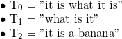

# Elasticsearch基础

## Elasticsearch是什么

Elasticsearch 是基于`Apache Lucene`的一个`可水平扩展的实时分布式搜索和分析引擎`，它是`Elastic Stack`的核心。

## 倒排索引(Inverted index)<sup>[1](#invertedIndex)</sup>

倒排索引（英语：Inverted index），也常被称为反向索引、置入档案或反向档案，是一种索引方法，被用来存储在全文搜索下某个单词在一个文档或者一组文档中的存储位置的映射。它是文档检索系统中最常用的数据结构。

有两种不同的反向索引形式：

* 一条记录的水平反向索引（或者反向档案索引）包含每个引用单词的文档的列表。
* 一个单词的水平反向索引（或者完全反向索引）又包含每个单词在一个文档中的位置

后者的形式提供了更多的兼容性（比如短语搜索），但是需要更多的时间和空间来创建。

### 例子

以英文为例，下面是要被索引的文本：



我们就能得到下面的反向文件索引：

```text
 "a":      {2}
 "banana": {2}
 "is":     {0, 1, 2}
 "it":     {0, 1, 2}
 "what":   {0, 1}
```

检索的条件`"what"`, `"is"` 和 `"it"` 将对应这个集合：。
对相同的文字，我们得到后面这些完全反向索引，由文档数量和当前查询的单词结果组成的的成对数据。 同样，文档数量和当前查询的单词结果都从零开始。所以，`"banana": {(2, 3)}` 就是说 "banana"在第三个文档里 (T2)，而且在第三个文档的位置是第四个单词(地址为 3)。

```text
"a":      {(2, 2)}
"banana": {(2, 3)}
"is":     {(0, 1), (0, 4), (1, 1), (2, 1)}
"it":     {(0, 0), (0, 3), (1, 2), (2, 0)}
"what":   {(0, 2), (1, 0)}
```

如果我们执行短语搜索`"what is it"` 我们得到这个短语的全部单词各自的结果所在文档为文档0和文档1。但是这个短语检索的连续的条件仅仅在文档1得到。

### 应用

* 反向索引数据结构是典型的搜索引擎检索算法重要的部分。
* 一个搜索引擎执行的目标就是优化查询的速度：找到某个单词在文档中出现的地方。以前，正向索引开发出来用来存储每个文档的单词的列表，接着掉头来开发了一种反向索引。 正向索引的查询往往满足每个文档有序频繁的全文查询和每个单词在校验文档中的验证这样的查询。
* 实际上，时间、内存、处理器等等资源的限制，技术上正向索引是不能实现的。
* 为了替代正向索引的每个文档的单词列表，能列出每个查询的单词所有所在文档的列表的反向索引数据结构开发了出来。
* 随着反向索引的创建，如今的查询能通过立即的单词标示迅速获取结果（经过随机存储）。随机存储也通常被认为快于顺序存储。

> <a name="invertedIndex">1</a>: 摘自[维基百科-倒排索引](https://zh.wikipedia.org/wiki/%E5%80%92%E6%8E%92%E7%B4%A2%E5%BC%95)
